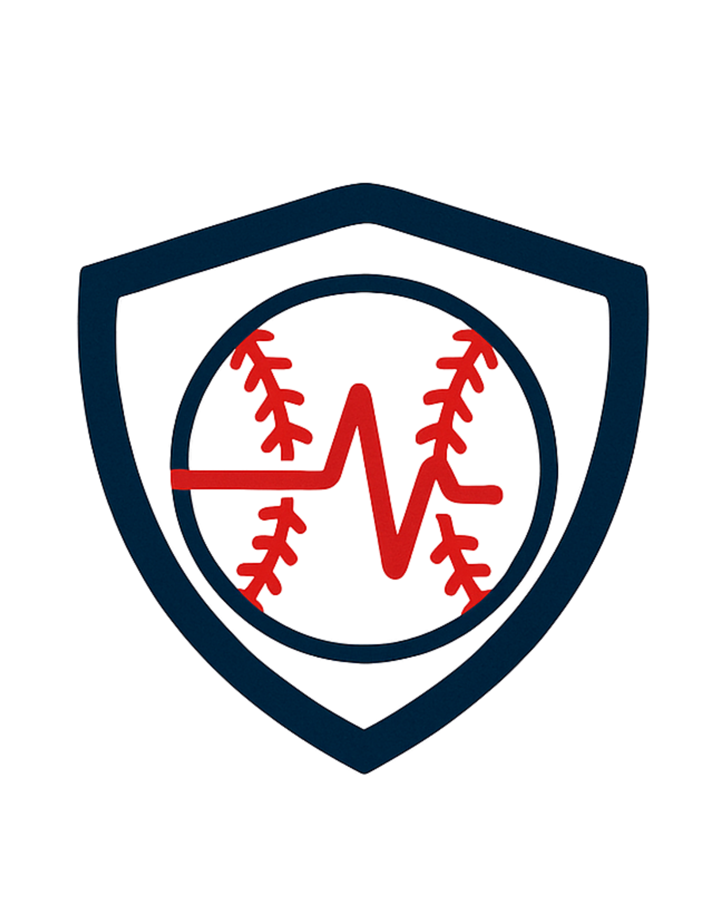

<p align="center">
  
</p>

<h1 align="center">Pitch Safe - Pitcher Injury Prevention & Performance Analytics</h1>
<h3 align="center">Empowering baseball pitchers and coaches with data-driven insights to prevent injuries and optimize performance.</h3>

<p align="center">
  
</p>

---

## Mission Statement

Pitch Safe is a comprehensive web application designed to help baseball coaches and trainers monitor pitcher health, predict injury risks, and make data-informed decisions about player workload management. By combining real-time performance tracking with machine learning analysis, we aim to reduce pitcher injuries and extend athletic careers.

---

## Problem Statement

Pitcher injuries, particularly to the elbow and shoulder, have reached epidemic proportions in baseball at all levels. Studies show:

- **~25% of MLB pitchers** undergo Tommy John surgery during their careers
- **Youth pitcher injuries** have increased by over 500% in the past 20 years
- **Overuse and fatigue** are leading contributors to preventable injuries
- **Traditional monitoring methods** are reactive rather than proactive

### Current Challenges:

1. **Lack of Real-Time Data** — Coaches track performance manually with spreadsheets and paper
2. **No Early Warning System** — Injuries are noticed only after damage occurs
3. **Inconsistent Monitoring** — No standardized way to track pitcher workload across teams
4. **Limited Analysis Tools** — Difficulty identifying patterns and trends in performance data

---

## Our Solution

Pitch Safe provides:

**Injury Risk Prediction** — ML algorithms analyze patterns to flag potential injury risks  
**Historical Analytics** — Visualize trends over time to make informed decisions  
**Coach Dashboard** — Manage entire rosters with personalized player insights  
**Data-Driven Alerts** — Get notified when players show concerning patterns

---

## Technology Stack

## Brief Code Architecture

PitchSafe follows a Clean Architecture–based repository structure that separates concerns across independent layers for scalability, maintainability, and testability. The project is divided into a frontend and backend, both organized by layers rather than pages or components, with a shared src/ directory for common resources. In the frontend, React components interact only through interface adapters and use-cases, ensuring UI logic remains isolated from infrastructure. The backend mirrors this structure with entities, use-cases, interface adapters, and framework drivers for Express, PostgreSQL, and the ML pipeline. This consistent architecture enforces clear boundaries between domain logic, application logic, and external systems across the entire codebase.

### Backend

- **Node.js & Express** — RESTful API server
- **PostgreSQL** — Relational database (via Supabase)
- **Clean Architecture** — Maintainable, testable, scalable code
- **Jest** — Comprehensive testing framework (300+ tests)
- **Python/scikit-learn** — Machine learning injury prediction models

### Frontend

- **React** — Modern, component-based UI
- **Vite** — Fast development build tool
- **Recharts** — Data visualization and analytics
- **Clean Architecture** — Separation of concerns, dependency injection

### Infrastructure

- **Supabase** — Cloud PostgreSQL hosting
- **GitHub Actions** — CI/CD pipeline
- **Local PostgreSQL** — Isolated testing environment

---

## Prerequisites

Download

- [Docker Desktop](https://www.docker.com/products/docker-desktop/)
- [Node.js](https://nodejs.org/) v18 or higher
- [Git](https://git-scm.com/)
- [PostgreSQL 14+](https://www.postgresql.org/) (for local testing)
- [Supabase Account](https://supabase.com) (credentials from team lead)

---

## Quick Start Guide

### 1. Clone the Repository

```bash
git clone <your-repo-url>
cd Pitch Safe
```

### 2. Install Dependencies (Non-Docker Only)

```bash
# Backend
cd backend
npm install

# Frontend
cd ../frontend
npm install
```

### 3. Configure Environment Variables
NOTE: In the future, Docker will support both .env files or environment variables inside docker-compose.yml.

#### Backend Production (`.env`)

Create `backend/.env`:

```bash
# Supabase Database (Production/Development)
DB_USER=postgres
DB_HOST=db.xxxxxxxxxxxxx.supabase.co
DB_NAME=postgres
DB_PASSWORD=your_supabase_password
DB_PORT=5432

# ML Dataset Path
CSV_DATASET_PATH= # that is in the local. (here we are using yankees)

# Server Configuration
PORT=5001
NODE_ENV=development
```

#### Testing Environment (`.env.test`)

Create `backend/.env.test`:

```bash
# Local PostgreSQL (Testing Only)
DB_USER=postgres
DB_HOST=localhost
DB_NAME=pitchsafe_test_db
DB_PASSWORD=
DB_PORT=5432
```

### 4. Start the Application

#### Option 1: Run with Docker (Recommended)
Docker will start all services (frontend, backend, ML model API).
```bash
# Build images (only needed when code changes)
docker compose up --build

# Start the stack normally
docker compose up
```
**Access the application:**
- Frontend: http://localhost:5173
- Backend API: http://localhost:5001
- ML Python API: http://localhost:5002

#### Option 2: Run without Docker
```bash
# Terminal 1 - Start Backend
cd backend/ml_injury/training_pipeline
npm run dev

# Terminal 2 - Start Frontend
cd frontend
npm run dev
```

**Access the application:**

- Frontend: http://localhost:5173
- Backend API: http://localhost:5001

---

## Testing Setup (Local Machine – Not Docker)

Pitch Safe uses **Jest** to ensure code quality and prevent regressions.

### One-Time Setup

#### Step 1: Install PostgreSQL

**macOS:**

```bash
brew install postgresql@14
brew services start postgresql@14
echo 'export PATH="/usr/local/opt/postgresql@14/bin:$PATH"' >> ~/.zshrc
source ~/.zshrc
```

#### Step 2: Create PostgreSQL User

```bash
psql postgres
CREATE ROLE postgres WITH LOGIN SUPERUSER CREATEDB CREATEROLE;
\q
```

#### Step 3: Create Test Database

```bash
createdb -U postgres pitchsafe_test_db
```

#### Step 4: Initialize Test Data

```bash
cd backend
npm run test:setup
```

#### Step 5: Run Backend Tests

```bash
npm test
```

#### Step 5: Run Frontend Tests

```bash
cd frontend
npm test
```


---
## Breif User Guide

Once Pitch Safe is running—either through Docker or a local setup provided by the above section, you can access the platform by visiting **http://localhost:5173**, which opens the Pitch Safe Dashboard directly in your browser. No installation is required, as everything operates through the web. As a coach, you can log in using your team’s assigned email and password, or, if you’d like to explore the demo Yankees team, you may use **aa@gmail.com** with the password **aaaaaa**. You can also create a new account and log in again to manage your own roster. After logging in, you’ll be taken to the Player Dashboard, where each pitcher is displayed along with an automatically generated injury risk score based on their recorded workload and performance history. If you want to review a player in more detail, simply click on their profile image to view personal information and add new game records. To export your team’s data, navigate to the Download tab, where you can download a fully formatted Excel report containing all player statistics and injury insights.

---

## Team Members

<p align="center">
  
</p>

| Japleen K. | Derek Y. | Lihi G. | Abhinn K. | Pongpang K. |
|:----------:|:--------:|:-------:|:---------:|:-----------:|
| [Japleen K.](https://www.linkedin.com/in/japleen-kaur-uoft/) | [Derek Y.](https://www.linkedin.com/in/derek-yu-can/) | [Lihi G.](https://www.linkedin.com/in/lihi-galezer/) | [Abhinn K.](https://www.linkedin.com/in/abhinn-kaushik2028/) | [Pongpang K.](https://www.linkedin.com/in/napaorn-kao-ian/) |
| Interest in ML & FinTech | Interest in Quantum Computing | Interest in SWE & UI | Interest in ML and Data algorithms | Interest in Computer Vision & Human Perception |

---
